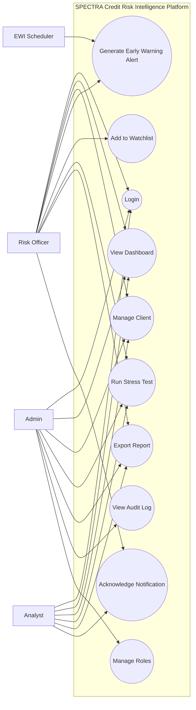
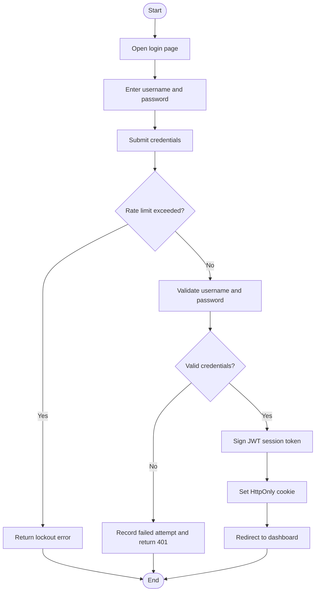
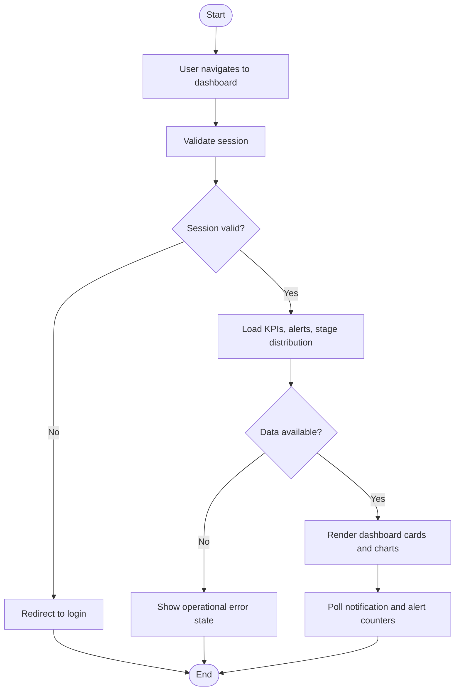
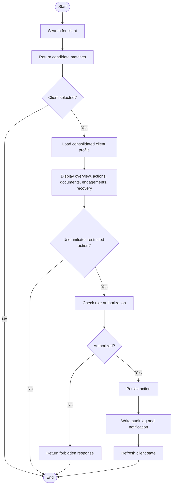
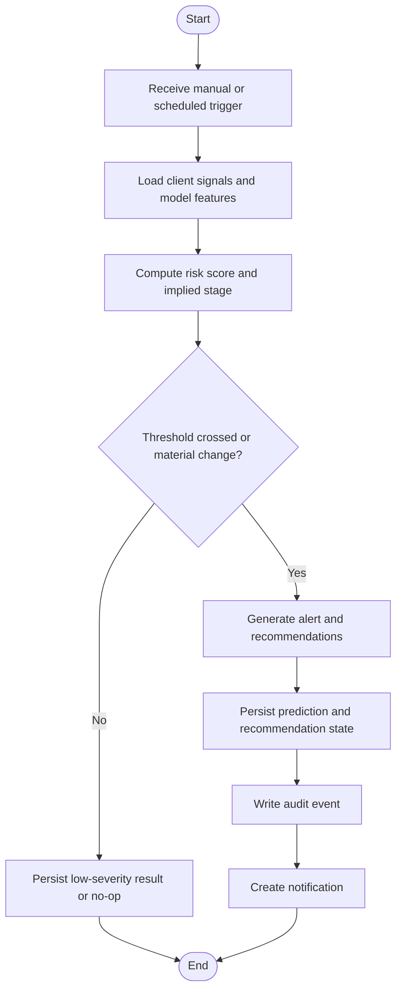
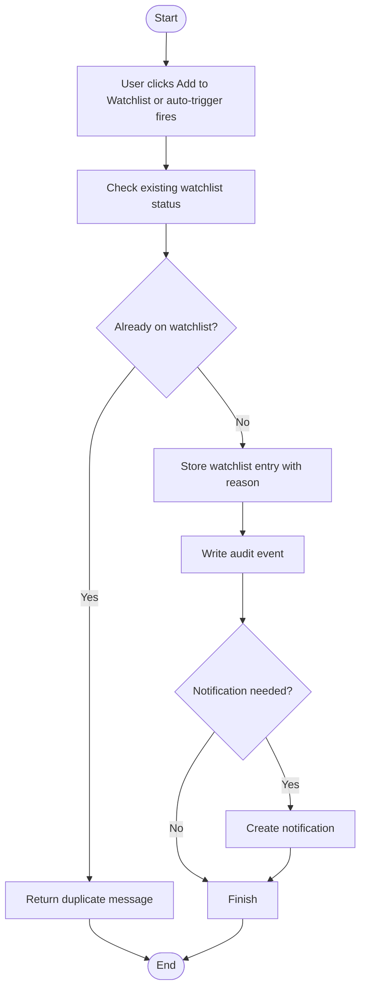
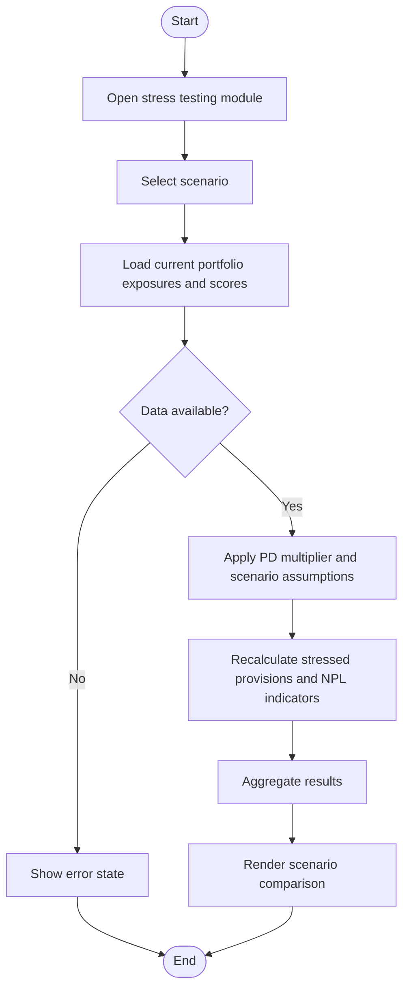
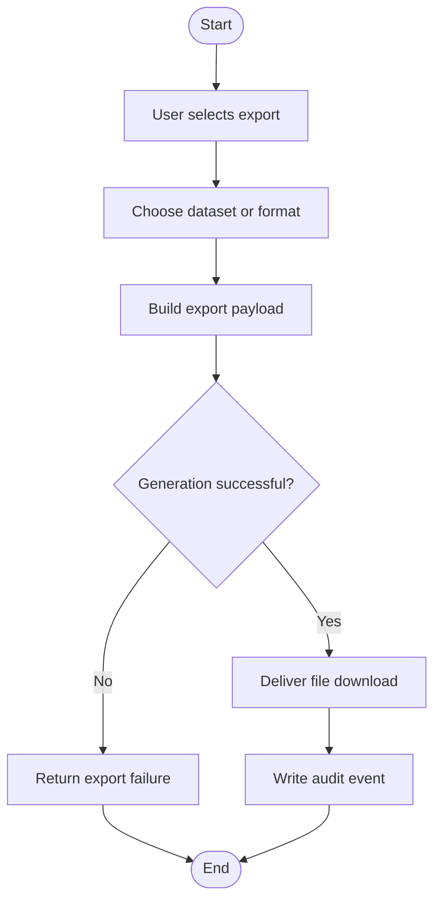
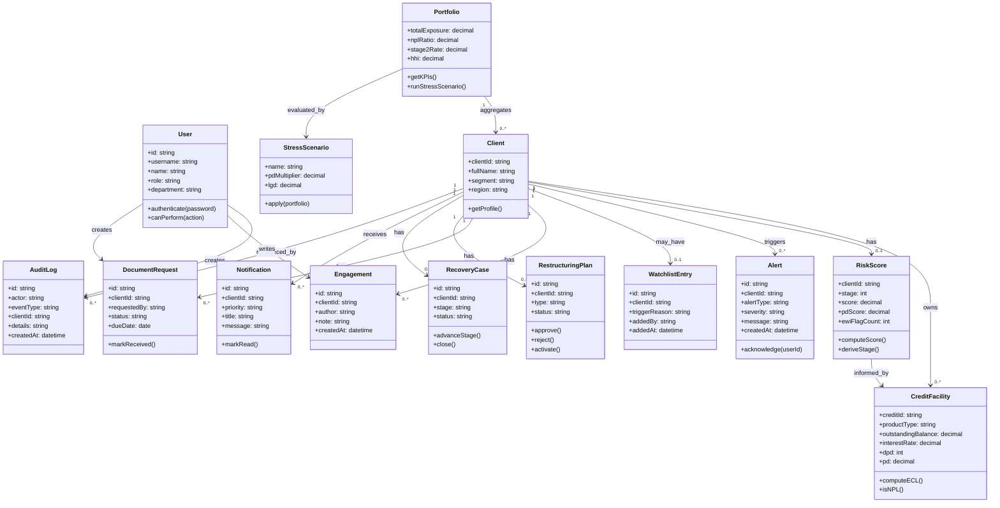
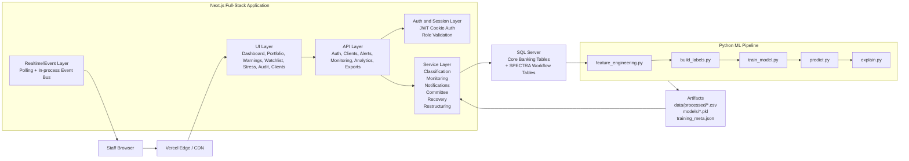

# SPECTRA Credit Risk Intelligence Platform
## Software Requirements and Design Document

Version: 1.1
Date: 2026-03-30
Basis: Current SPECTRA codebase, deployment shape, and target operating scope.
Primary sources scanned: `frontend/src/app`, `frontend/src/lib`, `sql/`, `docker-compose.yml`, `SPECTRA_DELIVERABLES.md`, `SPECTRA_Requirements_Design_Document.md`, and `spectra.md`.
Scope note: This document covers the internal SPECTRA web application and ML pipeline. Power BI export artifacts are intentionally excluded.

---

## Table of Contents
1. Business Need
2. Key Functionalities
3. System Requirements Analysis
4. User Stories
5. Use Case Diagram
6. Use Case Descriptions
7. Activity Diagrams
8. Class Diagram
9. Rough High-Level Design

---

## 1. Business Need

Financial institutions need a dedicated credit risk intelligence platform because credit risk management is both an analytics problem and an operational control problem. In a typical bank, portfolio signals, client records, monitoring actions, committee notes, and reporting outputs are fragmented across core banking systems, spreadsheets, email, and static reports. That fragmentation slows intervention and weakens governance.

SPECTRA addresses the following core pain points:

- Late detection of deteriorating clients.
- Manual and inconsistent IFRS 9 stage review.
- No single operational view of client risk.
- Weak orchestration from alert to action.
- Heavy audit and reporting effort.
- Limited visibility into concentration and stress exposure.

The platform delivers value by role.

**Risk Officers**
- Get a prioritized work queue instead of manually reviewing the whole book.
- See why a client is risky and what action is recommended.
- Can freeze, monitor, request documents, escalate, restructure, and open recovery cases in one system.

**Analysts**
- Can inspect client-level and portfolio-level trends without switching tools.
- Can prepare committee and management materials faster.
- Can analyze model outputs, risk drivers, and stress results in one place.

**Bank Administrators / Control Functions**
- Gain role-based control, system visibility, and auditability.
- Can review operational evidence and governance events centrally.
- Reduce effort for internal audit, senior management, and regulator review.

At a strategic level, SPECTRA enables earlier intervention, more consistent stage governance, better portfolio decisions, stronger concentration oversight, and better evidence of control execution.

---

## 2. Key Functionalities

### 2.1 Dashboard
Provides a real-time portfolio snapshot with KPI cards, stage distribution, alert summaries, and recent high-risk movement.

### 2.2 Portfolio Monitoring
Tracks monitoring cadence, freeze status, collateral reviews, document requests, and operational follow-up.

### 2.3 Client Management
Supports client search and a consolidated client profile with exposures, stage, DPD, PD, actions, documents, engagements, restructuring, and recovery history.

### 2.4 Early Warning Alerts
Evaluates deterioration signals such as PD movement, DPD trend, missed payments, salary interruption, overdraft dependency, and collateral risk. Produces alerts and recommended actions.

### 2.5 Watchlist
Maintains a list of clients under heightened scrutiny, manually or automatically triggered.

### 2.6 Risk Analytics
Shows NPL, ECL, PD distribution, vintage behavior, repayment indicators, and key risk driver trends.

### 2.7 Concentration Analysis
Calculates top obligor exposure, product and segment concentration, and HHI.

### 2.8 Stress Testing
Applies adverse scenarios using PD multipliers and LGD assumptions to estimate stressed provisions and risk movement.

### 2.9 Audit Log
Stores immutable system and user actions, including stage changes, workflow actions, notifications, and exports.

### 2.10 User Role Management
Enforces access rules for `admin`, `risk_officer`, and `analyst`.

### 2.11 Notification Inbox
Provides a prioritized inbox for alerts, escalations, and system events.

### 2.12 Report Export
Allows operational and analytical views to be exported for management, committee, and audit use.

---

## 3. System Requirements Analysis

### 3.1 Functional Requirements

#### Authentication and Session Management

| ID | Requirement |
|---|---|
| FR-AUTH-01 | The system shall authenticate internal users with username and password. |
| FR-AUTH-02 | The system shall issue a signed JWT in an HttpOnly cookie after successful login. |
| FR-AUTH-03 | The system shall expire authenticated sessions after a defined TTL and require reauthentication. |
| FR-AUTH-04 | Protected routes and API endpoints shall require a valid session except public auth and health endpoints. |
| FR-AUTH-05 | The system shall enforce rate limiting for repeated failed login attempts. |

#### Role-Based Access Control

| ID | Requirement |
|---|---|
| FR-RBAC-01 | The system shall support `admin`, `risk_officer`, and `analyst` roles. |
| FR-RBAC-02 | Restricted actions shall be enforced server-side. |
| FR-RBAC-03 | Admin shall have governance and full operational privileges. |
| FR-RBAC-04 | Risk officers shall be able to execute workflow actions. |
| FR-RBAC-05 | Analysts shall have read-heavy access with limited operational actions such as engagement logging and alert acknowledgement. |

#### Dashboard and Client Management

| ID | Requirement |
|---|---|
| FR-OPS-01 | The system shall display portfolio KPIs such as total exposure, NPL ratio, Stage 2 rate, and delinquency indicators. |
| FR-OPS-02 | The system shall display active alerts and stage distribution. |
| FR-OPS-03 | The system shall allow users to search clients by name, customer identifier, or account reference. |
| FR-OPS-04 | The system shall display a consolidated client profile with exposures, products, risk signals, and workflow history. |
| FR-OPS-05 | The system shall support client-level actions from the profile subject to role permissions. |

#### Risk Scoring and EWI

| ID | Requirement |
|---|---|
| FR-RISK-01 | The system shall compute a composite risk score using PD, DPD severity, and EWI breadth. |
| FR-RISK-02 | The system shall derive an implied IFRS 9 stage from configurable quantitative and qualitative triggers. |
| FR-RISK-03 | The system shall support escalation to Stage 3 when NPL conditions are met. |
| FR-RISK-04 | The system shall persist stage changes and material risk score changes in the audit log. |
| FR-RISK-05 | The system shall evaluate EWI signals including PD, DPD, missed payments, salary behavior, overdraft dependency, and modeled migration risk. |
| FR-RISK-06 | The system shall generate recommendations and notifications when a material alert is created. |
| FR-RISK-07 | The system shall persist model outputs and explanations for later review. |
#### Workflow, Monitoring, Analytics, and Reporting

| ID | Requirement |
|---|---|
| FR-WF-01 | The system shall allow authorized users to freeze and unfreeze credit activity with a reason. |
| FR-WF-02 | The system shall support restructuring plans with defined plan types and statuses. |
| FR-WF-03 | The system shall support committee escalation and decision tracking. |
| FR-WF-04 | The system shall support recovery case creation and progression across recovery stages. |
| FR-WF-05 | The system shall assign monitoring frequency based on stage and monitoring state. |
| FR-WF-06 | The system shall allow collateral revaluation to be recorded with recalculated LTV. |
| FR-WF-07 | The system shall allow document requests to be created and fulfilled. |
| FR-WF-08 | The system shall support engagement and communication logging. |
| FR-WF-09 | The system shall provide portfolio analytics for exposure, delinquency, NPL, ECL, and PD behavior. |
| FR-WF-10 | The system shall calculate concentration metrics including top obligors and HHI. |
| FR-WF-11 | The system shall support scenario-based stress testing using configurable multipliers. |
| FR-WF-12 | The system shall create notifications for stage changes, alerts, and workflow events. |
| FR-WF-13 | The system shall write immutable audit records for material system and user actions. |
| FR-WF-14 | The system shall allow export of selected views and datasets. |

### 3.2 Non-Functional Requirements

| Category | Requirement |
|---|---|
| Security | Passwords shall be stored as strong one-way hashes and never in plaintext. |
| Security | Database access shall use parameterized queries. |
| Security | Secrets and credentials shall be stored in environment variables or secret management, not source code. |
| Security | Session cookies shall be HttpOnly and Secure in production. |
| Security | Session tokens shall be signed, tamper-evident, and validated on each protected request. |
| Performance | The system shall use SQL connection pooling and cache expensive reads where data freshness allows it. |
| Performance | Alert and notification refresh shall rely on lightweight endpoints. |
| Scalability | The web layer shall remain stateless at the session level so it can scale horizontally. |
| Scalability | The architecture shall support growth in clients, exposures, and alerts without redesigning the product. |
| Availability | The platform shall expose a health endpoint for database connectivity. |
| Availability | The UI shall fail visibly when the database or critical dependencies are unavailable. |
| Resilience | Optional model or AI services shall have graceful fallback behavior where possible. |
| Usability | The application shall be responsive for desktop and tablet usage. |
| Usability | Risk-critical information shall use consistent labels and visual severity conventions. |
| Data Integrity | SPECTRA shall not modify read-only source tables from the core banking domain. |
| Data Integrity | Workflow tables shall be attributable, timestamped, and auditable. |
| Compliance | The platform shall support IFRS 9-oriented stage governance, auditability, and large-exposure monitoring. |
| Maintainability | The design shall separate UI, API, service, and data-access concerns. |
| Maintainability | Thresholds and operational settings shall be configurable. |
| Maintainability | The ML pipeline shall be able to evolve independently from the web application. |

---

## 4. User Stories

### Admin
- As an **admin**, I want to authenticate securely, so that only authorized staff can access risk data.
- As an **admin**, I want to review the audit trail by user, client, and event type, so that I can support control reviews and regulator requests.
- As an **admin**, I want to verify system health and connectivity, so that I can identify operational issues early.
- As an **admin**, I want to manage roles and access policy, so that privileged actions remain restricted.

### Risk Officer
- As a **risk_officer**, I want to see portfolio KPIs and high-priority alerts immediately after login, so that I can prioritize my workday.
- As a **risk_officer**, I want to open a client profile with exposures, signals, and history in one place, so that I can act faster.
- As a **risk_officer**, I want the system to raise early warning alerts when deterioration signals appear, so that I can intervene before risk worsens.
- As a **risk_officer**, I want to freeze a facility with a documented reason, so that I can prevent further utilization while a case is reviewed.
- As a **risk_officer**, I want to request documents and track receipt, so that follow-up is controlled inside the platform.
- As a **risk_officer**, I want to escalate a case to committee or recovery and keep the decision trail in one system, so that governance is preserved.
- As a **risk_officer**, I want to run stress scenarios, so that I can understand provision and NPL impact under adverse conditions.
- As a **risk_officer**, I want concentration risk and watchlist entries surfaced automatically, so that material single-name exposures do not go unnoticed.

### Analyst
- As an **analyst**, I want to view trend analytics across the portfolio, so that I can identify emerging patterns and prepare management analysis.
- As an **analyst**, I want to inspect model predictions and drivers for a client, so that I can support committee and investigation work with evidence.
- As an **analyst**, I want to log engagements and supporting notes, so that client operating history is preserved.
- As an **analyst**, I want to export selected data, so that I can prepare working papers and presentations.

## 5. Use Case Diagram

---

## 6. Use Case Descriptions

### UC-01: Login

| Field | Description |
|---|---|
| Use Case Name | Login |
| Actor | Admin, Risk Officer, Analyst |
| Preconditions | User has valid credentials and the public login endpoint is reachable. |
| Main Flow | 1. User opens the login page. 2. User submits username and password. 3. System checks rate-limit status. 4. System validates credentials. 5. System signs a session token. 6. System stores the token in an HttpOnly cookie. 7. System redirects the user to the dashboard. |
| Alternative Flows | Invalid credentials, lockout due to repeated failures, or server-side configuration error. |
| Postconditions | Valid session exists and protected routes are accessible. |

### UC-02: View Dashboard

| Field | Description |
|---|---|
| Use Case Name | View Dashboard |
| Actor | Admin, Risk Officer, Analyst |
| Preconditions | User is authenticated and portfolio data sources are reachable. |
| Main Flow | 1. User navigates to the dashboard. 2. System validates the session. 3. System loads KPIs, stage distribution, and alerts. 4. System renders charts and indicators. 5. System refreshes notification counters periodically. |
| Alternative Flows | Empty alert state or operational error state when data cannot be loaded. |
| Postconditions | User sees a current portfolio summary and no data is modified. |

### UC-03: Manage Client

| Field | Description |
|---|---|
| Use Case Name | Manage Client |
| Actor | Risk Officer, Admin, Analyst (read-only for restricted actions) |
| Preconditions | User is authenticated and the client exists. |
| Main Flow | 1. User searches for a client. 2. System returns matches. 3. User opens a client profile. 4. System loads the consolidated profile. 5. User reviews overview, signals, actions, documents, engagements, restructuring, and recovery. 6. If authorized, user executes an action. 7. System persists the action and writes an audit event. |
| Alternative Flows | Client not found or user not authorized for the requested action. |
| Postconditions | Client view is displayed and any valid action is recorded. |

### UC-04: Generate Early Warning Alert

| Field | Description |
|---|---|
| Use Case Name | Generate Early Warning Alert |
| Actor | Risk Officer, EWI Scheduler |
| Preconditions | Client exists and required signals or model outputs are available. |
| Main Flow | 1. System gathers client signals. 2. System computes or retrieves model outputs. 3. System derives risk score and implied stage. 4. System identifies triggered signals and recommendations. 5. System persists prediction output. 6. System writes audit and notification records. |
| Alternative Flows | Model output unavailable and rule-based fallback is used, or thresholds are not crossed and no material alert is generated. |
| Postconditions | Alert state is available for operational review. |

### UC-05: Add to Watchlist

| Field | Description |
|---|---|
| Use Case Name | Add to Watchlist |
| Actor | Risk Officer, Admin |
| Preconditions | User is authenticated, authorized, and the client exists. |
| Main Flow | 1. User selects Add to Watchlist or the system triggers auto-watchlist logic. 2. System checks whether the client already exists on the watchlist. 3. System stores the watchlist entry. 4. System generates notification if required. 5. System writes an audit event. |
| Alternative Flows | Duplicate entry is rejected. |
| Postconditions | Client appears on the watchlist with recorded reason and timestamp. |

### UC-06: Run Stress Test

| Field | Description |
|---|---|
| Use Case Name | Run Stress Test |
| Actor | Risk Officer, Analyst, Admin |
| Preconditions | User is authenticated and portfolio exposure and risk data are available. |
| Main Flow | 1. User opens the stress module. 2. User selects a scenario. 3. System applies scenario assumptions to the portfolio. 4. System recalculates stressed provisions and related indicators. 5. System displays scenario comparison results. |
| Alternative Flows | Missing or stale data causes an error or warning state. |
| Postconditions | Stress results are visible and optionally exportable. |

### UC-07: Export Report

| Field | Description |
|---|---|
| Use Case Name | Export Report |
| Actor | Risk Officer, Analyst, Admin |
| Preconditions | User is authenticated and the target dataset is available. |
| Main Flow | 1. User clicks Export. 2. User selects scope or format. 3. System serializes the selected data. 4. System returns the downloadable file. 5. System writes an audit event. |
| Alternative Flows | Dataset too large or generation failure causes an error and retry path. |
| Postconditions | Export file is generated or the failure is reported. |

---

## 7. Activity Diagrams

### AD-01: Login

### AD-02: View Dashboard

### AD-03: Manage Client

### AD-04: Generate Early Warning Alert

### AD-05: Add to Watchlist

### AD-06: Run Stress Test

### AD-07: Export Report

---

## 8. Class Diagram

---

## 9. Rough High-Level Design

### 9.1 Architecture Overview
SPECTRA uses a layered modular monolith architecture for the web application and a separate batch ML pipeline for model training and artifact generation.

At a high level:
- the frontend and backend API live in the same Next.js application,
- authentication, authorization, and business rules run server-side,
- SQL Server is the system of record for core banking data and SPECTRA-managed workflow tables,
- a separate Python pipeline trains models, scores clients, creates explanations, and exports analytical datasets,
- and the deployed web application runs on Vercel.

### 9.2 Frontend (Next.js)
The presentation layer is implemented with Next.js App Router pages and React components.

Primary responsibilities:
- render dashboard, portfolio, monitoring, watchlist, concentration, stress, audit, notification, and client-detail views,
- initiate workflow actions,
- show charts, alerts, notifications, and detail panels,
- support responsive internal staff experiences.

### 9.3 Backend API Layer
The backend is implemented as Next.js route handlers and service modules.

Primary layers:
- Route handlers for validation, auth checks, and request-response orchestration.
- Service layer for classification, monitoring, notifications, restructuring, committee, recovery, and messaging logic.
- Data access layer for SQL Server connectivity and parameterized query execution.

This keeps domain logic out of the UI and allows operational workflows to be reused consistently.

### 9.4 Authentication Service
Authentication is embedded in the web application rather than deployed as a separate external service.

Internal authentication:
- username/password login,
- JWT stored in an HttpOnly cookie,
- eight-hour session TTL,
- rate-limited login endpoint,
- middleware- and route-level session validation on protected routes.

### 9.5 Database Schema Overview
The data model has two logical zones.

**Core banking / source tables (read-only to SPECTRA)**
- `Customer`
- `Credits`
- `RiskPortfolio`
- `DueDaysDaily`
- `Accounts`
- `TAccounts`
- `AmortizationPlan`
- `CC_Event_LOG`

**SPECTRA-managed workflow and control tables**
- `SystemActions`
- `Notifications`
- `ClientMonitoring`
- `CollateralReview`
- `DocumentRequests`
- `ECLProvisions`
- `RecoveryCases`
- `RestructuringPlans`
- `CreditCommitteeLog`
- `AlertAcknowledgements`
- `ClientMessages`

Schema notes:
- source data remains read-only,
- workflow tables hold operational state and audit evidence,
- some application-managed tables can be created lazily on first use in the current implementation.

### 9.6 External Integrations
The main integrations are:
- SQL Server for source and workflow persistence,
- Python / scikit-learn batch ML pipeline for features, labels, training, prediction, and explanation,
- optional AI provider integration for narrative summaries when configured.

### 9.7 Deployment Infrastructure (Vercel)
Current deployment model:
- web application deployed from `frontend/` to Vercel,
- environment variables managed in the deployment platform,
- API routes run in the Vercel-hosted Next.js runtime,
- SQL Server accessed over a secure database connection,
- health check available through `/api/db/ping`.

Supporting deployment path:
- local or containerized setup uses `docker-compose` with `app` and `pipeline` services.

Operational note:
- the current in-process event bus is suitable for single-process or limited-node deployment and should move to distributed pub/sub such as Redis for full multi-instance realtime behavior.

### 9.8 System Architecture Diagram

### 9.9 High-Level Design Summary
SPECTRA is best described as:

`Next.js modular monolith + SQL Server + separate Python batch ML pipeline`

This design is appropriate because it centralizes sensitive risk logic on the server, keeps operational complexity lower than a microservices split, allows analytics and workflow to share one domain model, and lets the ML lifecycle evolve independently from the transactional web layer.

---

## Appendix: Recommended Future Enhancements
- replace the in-memory user store with enterprise identity or database-backed user administration,
- replace the in-process event bus with Redis or equivalent distributed pub/sub,
- add formal schema migrations for all application-managed tables,
- add scheduled pipeline orchestration and model-run observability,
- add stronger report packaging and committee case generation workflows.
